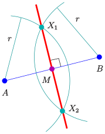

# [Geometry](https://en.wikipedia.org/wiki/Geometry)
_by Daniel B._

## Constructs

### [Line Segment](https://en.wikipedia.org/wiki/Line_segment)

- part of a straight line that is bounded by two distinct endpoints
- contains every point on the line that is between its endpoints
- closed line segment includes both endpoints
- open line segment excludes both endpoints
- half-open line segment includes exactly one of the endpoints

#### Operations

##### Add
##### Subtract
##### Copy
